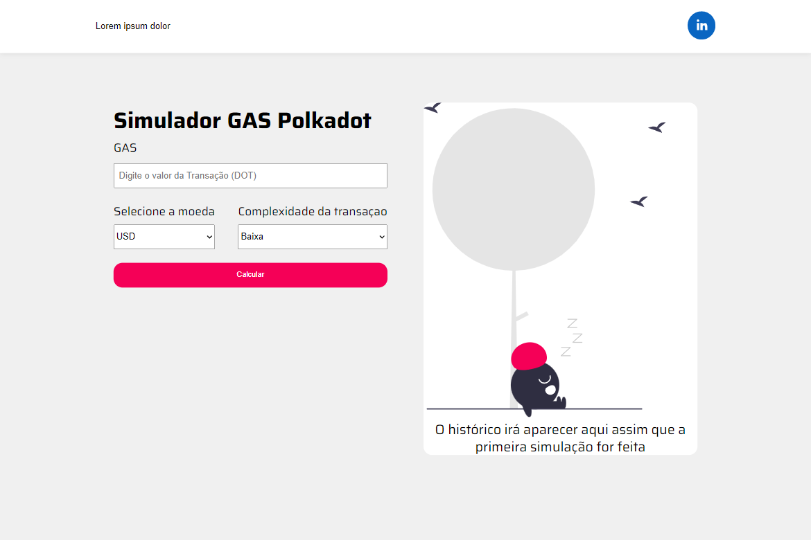
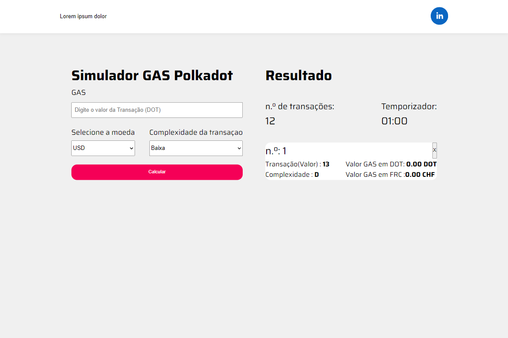

simuladorDePrecoDeGasNaPolkadot

 
<h1>Primeira Versão(Estática)</h1>
 

 
 

 
 
<h1>Melhorias e Desafios :</h1>
 
<ol>
<li>Caso seja inserido um valor menor que zero será exibida uma mensagem embaixo do input e o botão de calcular fica desabilitado</li>
<li></li>
<li></li>
</ol>

Em construção
